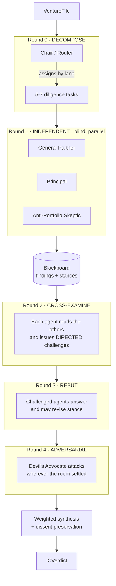

# Multi-Agent Architecture

How the committee actually deliberates, why it is built this way, and how we
prove the collaboration is real rather than decorative.

---

## 1. The thesis

The obvious way to build "many AI agents give opinions" is a fan-out:

```
              ┌── agent 1 ──┐
  idea ───────┼── agent 2 ──┼──▶ mean(scores) ──▶ "consensus"
              └── agent N ──┘
```

Every agent gets the same prompt with a different persona header. They run in
parallel, never see each other, and the "consensus" is an arithmetic mean.

**This is not multi-agent collaboration. It is N single-agent calls with an
average at the end.** It has three specific failures:

1. **No agent learns anything.** The system cannot produce a conclusion that no
   individual member reached. That emergent conclusion is the entire reason to
   convene a committee.
2. **Averaging destroys the signal.** One expert who is certain the thing is
   fatally flawed gets cancelled out by four who are mildly positive. In a real
   investment committee that one voice stops the deal.
3. **Personas collapse.** One model prompted N ways regresses to one opinion in
   N costumes. Fan-out has no mechanism that would even detect this.

This is how almost every "multi-agent" demo is actually built: a `Promise.all`
over independent per-persona calls returning a sentiment score, averaged
afterward. It is a reasonable engineering choice for sampling a *market*, where
independence is exactly what you want. It is the wrong choice for a
*committee*, where the argument between members is the product.

**We build the argument.**

---

## 2. The protocol

Five rounds. Agents are blind first, then they talk to each other, then they
are allowed to change their minds, and every one of those events is recorded.



### Round 0 · Decompose

A non-voting Chair splits the decision into 5-7 concrete diligence questions and
assigns each to the one agent whose declared lane owns it.

This is the piece that makes it a *system* rather than a crowd. Agents are not
all answering "what do you think of this idea", the GP is answering "is the
market big enough to return the fund", the Principal is answering "what is CAC
payback", the Skeptic is answering "what does this rhyme with that we passed
on". Specialization is assigned, not merely suggested by a persona blurb.

Fails safe: if decomposition returns nothing usable, each agent falls back to
its declared `focus` areas and the meeting still runs.

### Round 1 · Independent (blind)

Agents answer only their assigned questions, in parallel, with **no visibility
into each other**. Blindness here is deliberate: if agents see each other's
positions before forming their own, they anchor, and anchoring is precisely how
N agents quietly become one agent.

### Round 2 · Cross-examination

Now they see everything. Each agent may issue **at most two challenges, each
addressed to a specific agent by id**.

```
   ┌─────────────┐   "your TAM assumes every team      ┌─────────────┐
   │  Principal  │────has a reliability budget"───────▶│     GP      │
   └─────────────┘                                     └─────────────┘
          ▲                                                   │
          │  "CAC payback is the wrong                        │
          │   metric pre-revenue"                             │
          │                                                   ▼
   ┌─────────────┐                                     ┌─────────────┐
   │   Skeptic   │◀───"you are pattern-matching"───────│     GP      │
   └─────────────┘                                     └─────────────┘
```

Two constraints matter. Challenges must be **directed**, a challenge with a
named recipient forces the model to engage with a specific claim rather than
emit generic scepticism. And agents are explicitly told to return *no*
challenges rather than manufacture disagreement, so the challenge count means
something.

Self-challenges and challenges to agents not in the room are dropped.

### Round 3 · Rebuttal and belief revision

Challenged agents answer and restate stance and confidence. They may concede.

The prompt walks a deliberate line: conceding when a colleague is right is doing
the job properly, but convictions are not up for negotiation merely because
someone pushed. `conceded` is recorded separately from the numeric stance
change, so we can distinguish *persuaded* from *drifted*.

**This round is where emergence lives.** A stance that moves between round 1 and
round 3 is a conclusion the system reached that no individual agent started with.

### Round 4 · Adversarial

The Devil's Advocate runs last, sees where the room settled, and attacks that.
It exists because convergence is suspicious: a committee that agrees quickly has
usually found the obvious answer, which everyone else has also found.

---

## 3. The message bus

Everything agents say to each other is a typed message, not a string appended to
a growing prompt.

```ts
type AgentMessage = {
  id: string;
  round: number;
  from: AgentId;
  to: AgentId | "room";      // directedness is the point
  kind: "finding" | "challenge" | "rebuttal" | "concession";
  text: string;
  inReplyTo?: string;        // threads challenge → rebuttal
};
```

Because messages are typed and threaded, the deliberation is a **graph**, and
that graph is renderable, replayable, and testable. It is also the demo: you can
show a judge who challenged whom, about what, and who moved.

---

## 4. Proving it worked

A claim of multi-agent collaboration is worth nothing without evidence. The
protocol emits metrics whose only purpose is to make the claim falsifiable.

| Metric | What it proves | Failure signal |
|---|---|---|
| `varianceByRound` | Stance spread after each round | Near-zero at round 1 = personas collapsed |
| `challenges` | Agents engaged with specific claims | Zero = nobody read anybody |
| `concessions` | Agents were genuinely persuaded | Always-zero = agents are stubborn props |
| `mindChanges[]` | Per-agent stance delta, round 1 → final | All zero = rounds 2-3 changed nothing and could be deleted |
| `convergence` | Variance drop across deliberation |, |

`convergence` is deliberately signed. Positive means the room converged.
**Negative is a legitimate and more interesting outcome**: deliberation surfaced
a disagreement that independent sampling had hidden. A fan-out architecture
cannot produce a negative convergence at all, because it has nothing to converge
from.

The test suite asserts a **stance-variance floor**. If the agents ever
homogenize into one voice, the build fails, we find out at hour 7, not on stage.

---

## 5. Synthesis · weighting, not averaging

Averaging is what we are avoiding, so the final score is confidence-weighted and
dissent is preserved rather than smoothed away.

```
normalize:  w'ᵢ = wᵢ / Σw
score:      S = Σ (w'ᵢ · cᵢ · sᵢ) / Σ (w'ᵢ · cᵢ)
penalty:    S -= 0.08 × unansweredObjections
decision:   S ≥ 0.35 invest │ −0.10 … 0.35 conditional │ < −0.10 pass
dissent:    surfaced whenever |sᵢ − S| > 0.6
```

Two properties worth naming:

- **Confidence gates weight.** A 50%-weight GP who admits low confidence does
  not steamroll a 20%-weight Skeptic who is certain. Seat authority and epistemic
  authority are different things.
- **Dissent is never averaged away.** A lone hard no is promoted to the top of
  the report, not buried in a mean. This is the single most useful output the
  system produces, and it is exactly what fan-out destroys.

Weights are the seat defaults carried on the roster. Recomputation is a pure
synchronous function over cached votes, so re-reading a report never calls a
model and works with the network off.

The report once exposed those weights as live sliders. They were removed
deliberately. A founder cannot tell what re-weighting a partner is supposed to
mean, so the control invited a question it could not answer, and a score out of
a hundred invites optimising the figure rather than listening to the argument
underneath it.

---

## 6. Model selection

Two tiers, because the work has two shapes. Deep is seat reasoning,
cross-examination and rebuttal, which is the hardest thinking in the app and is
the product. Fast is the Moderator, which runs on every founder speech turn and
has under a second to decide whether a seat interrupts.

| Provider | Deep | Fast | Notes |
|---|---|---|---|
| Gemini | `gemini-2.5-flash` | `gemini-2.5-flash-lite` | What the public deployment runs on. Free tier, no card, 1,500 requests a day |
| OpenAI | `gpt-5.6-sol` | `gpt-5.6-luna` | Roughly $0.27 a deliberation |
| Anthropic | `claude-opus-5` | `claude-haiku-4-5` | |
| Demo | attribute-driven | attribute-driven | No key, no network, reactions computed from each persona's real fields |

Selection is automatic and falls through in that order in reverse. A paid key
that is present was set on purpose, so it wins over the free one.

The Gemini path disables thinking on the fast tier outright. The 2.5 Flash
models reason by default and that reasoning is billed against `maxOutputTokens`,
so an unconfigured Moderator call can think its way through the entire budget
and return an empty candidate, which reaches the table as a partner who says
nothing.

**Why not `gpt-6-astra`:** it is the most capable model available, built for hard
end-to-end agentic work over million-token contexts. Our calls are small,
structured, and numerous, that is not the shape of workload Astra is priced for,
and flagship latency × 15 sequential-ish calls hurts a live demo more than the
marginal reasoning gain helps. `OPENAI_MODEL=gpt-6-astra` upgrades it in one env
var if seat quality ever looks like the bottleneck.

**Why not `gpt-4o`:** two generations stale. It was the default in the first
scaffold pass and has been replaced.

For the live voice loop, `gpt-live-transcribe` is the low-latency STT option if
ElevenLabs Scribe latency disappoints, but ElevenLabs remains the TTS layer,
since distinct partner voices are the point.

---

## 7. Keeping the agents from agreeing

The failure mode that would quietly destroy this project is every agent
producing the same opinion. Five defences, in order of how much they matter:

1. **Hard priors.** Each agent carries convictions written as beliefs it already
   holds, deliberately in tension with the other agents'. The GP believes market
   size dominates; the Principal believes distribution dominates; the Skeptic
   believes every pitch has one fatal flaw. They cannot all be satisfied at once.
2. **Assigned lanes.** Decomposition gives each agent different *questions*, so
   they are not even answering the same thing.
3. **Blind first round.** No anchoring.
4. **Temperature spread.** 0.4 (Principal) → 0.9 (Skeptic) → 1.0 (Devil's
   Advocate).
5. **A structural dissenter.** The Devil's Advocate's function is to attack
   consensus, and it runs after consensus exists.

---

## 8. Failure modes

| Failure | Handling |
|---|---|
| One agent's call fails | `allSettled`, not `all`, the seat degrades to a neutral placeholder and the meeting continues. One dead agent must never empty the room. |
| Decomposition returns garbage | Falls back to lane-based assignment from each agent's declared `focus`. |
| Model returns prose around its JSON | `parseJSON` recovers from fenced blocks and surrounding prose before throwing. |
| Free tier throttles or runs out | The call falls through to the demo provider. A 429 steps back for a minute rather than for the day, because the free tier limits by the minute too and that is the one a live deliberation trips. |
| Model ignores "exactly two questions" | Output is normalized and truncated rather than trusted. |
| No API key at all | The demo provider computes every reaction from that persona's real attributes, so the mechanism is genuine and only the words are synthetic. |
| Venue wifi dies on stage | `DEMO_MODE=1` replays recorded fixtures. |

---

## 9. Reuse

`src/lib/agents/protocol.ts` is generic over `AgentTemplate[]` and a context
string. The VC committee and Track A's hub council are the **same protocol with
different rosters**, which is itself the argument that this is infrastructure
rather than one bespoke prompt chain.

```
protocol.deliberate()
        │
        ├── roster: [GP, Principal, Skeptic] + Devil's Advocate   → IC verdict
        └── roster: [Market, Founder, Customer, Regulatory, Capital] → hub finding
```

---

## 10. Known gaps

Honest list of what is not built yet, roughly in priority order.

- **No persistent memory across deliberations.** Each run starts cold; agents do
  not remember previous pitches from the same founder.
- **Rebuttal is one round.** Real committees iterate until they stop moving. A
  convergence-triggered loop (repeat rounds 2-3 until `|Δvariance| < ε`) is the
  natural upgrade and is deliberately deferred, it multiplies cost and latency.
- **No coalition detection.** Agents that consistently agree could be identified
  and down-weighted as correlated rather than independent evidence.
- **Challenge quality is graded, not scored.** The Chair now rules each
  challenge answered or dodged and those rulings reach the minutes as "left
  unanswered", which is the most actionable line a set of minutes carries. What
  is still missing is a measure of whether the challenge itself was any good, so
  a sharp objection and a lazy one still count the same.
- **The Moderator and the Chair overlap.** The Chair rules after the
  deliberation, the Moderator rules during the live pitch, and the two paths
  reach the same conclusion by different code.
