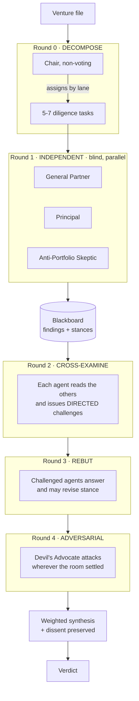

<div align="center">

# 🔭 Vision

**Founders build the solution before they understand the problem. Vision tells you which problem you are actually solving, whether a market wants it, and whether an investor would fund it. In that order, because that is the order the answers matter in.**

[](https://nextjs.org)
[](https://react.dev)
[](https://typescriptlang.org)
[](https://threejs.org)
[](#-tests)
[](LICENSE)

### Built at [Hack the North 2026](https://hackthenorth.com) · [Devpost](DEVPOST.md) · [Architecture](ARCHITECTURE.md)

</div>

---

## 📖 Overview

Ask a hundred people whether they like your product and you get a number. The
number is useless, because liking something and having the problem it solves are
different facts, and only one of them predicts whether anyone pays.

Vision asks a different question. It puts your product in front of a simulated
market of 326 professionals across 20 cities and asks each of them **which of
these problems do you actually have**, not whether they like what you built. The
answer is frequently not the one you pitched.

Then it makes you defend that problem out loud to a simulated investment
committee at one of 25 real firms, who interrupt, track what you dodged, and
vote.

The product exists to make one sentence possible.

> You pitched this, they have that, and they would pay for it.

---

## 🎬 The two parts

### Part 1 · the market

You describe what you built. The app splits it into four or five candidate
problems it could be solving, the first being your own framing. It then selects
120 people out of the library, deliberately including 30% who are a poor fit,
and deploys them onto a globe. Each answers which problem they have, and the
reactions stream back in as they land.

The reveal ranks the market's problem against yours **by weight of feeling
rather than headcount**, because ten people who cannot sleep over something beat
forty who find it mildly annoying. Five agents plus a Contrarian then argue about
whether the problem is worth solving in one specific city, and the run produces a
Problem Validation Score out of 100.

### Part 2 · the committee

You pick a firm, from Sand Hill Road to Lagos, and three of its partner agents
read your file and deliberate for five rounds **before you say a word**. You
watch the argument happen in a 3D boardroom, drawn live as who challenged whom.
Then you pitch by voice. They interrupt. The objection tracker fills. They vote,
weighted by seat, with dissent surfaced rather than averaged away.

Pull any partner aside for a private word and the room stops and waits.

---

## 🧠 What makes it different

Three claims, and the reason each one holds.

### 1. The question

Sentiment analysis over a crowd cannot tell you that your market has a different
problem from the one you pitched, because it never asked. This is not a tuning
difference, it is a structural one. Asking "which of these" instead of "do you
like it" produces a finding that averaging a score cannot reach.

### 2. The agents actually argue

The obvious way to build "many AI agents give opinions" is a fan-out.

```
              ┌── agent 1 ──┐
  idea ───────┼── agent 2 ──┼──▶ mean(scores) ──▶ "consensus"
              └── agent N ──┘
```

That is not multi-agent collaboration. It is N single-agent calls with an
average at the end, and it fails in three specific ways. No agent learns
anything, so the system can never produce a conclusion no individual member
already held. Averaging destroys the signal, so one expert who is certain the
thing is fatally flawed gets cancelled out by four who are mildly positive.
And personas collapse, because one model prompted N ways regresses to one
opinion in N costumes, and fan-out has no mechanism that would even detect it.

Both councils here run the same five-round protocol instead.



Agents are blind in round 1 on purpose. Seeing each other's positions before
forming their own is anchoring, and anchoring is precisely how N agents quietly
become one agent. Challenges in round 2 must name a recipient, because a
challenge addressed to nobody produces generic scepticism.

**When an agent concedes in round 3 and moves its stance, that is a conclusion
nobody walked into the room holding.** That is the whole point, and it is the
thing a fan-out cannot produce at all.

### 3. It is falsifiable

A claim of multi-agent collaboration is worth nothing without evidence, so the
protocol emits metrics whose only job is to make the claim disprovable.

| Metric | What it proves | Failure signal |
|---|---|---|
| `varianceByRound` | Stance spread after each round | Near-zero at round 1 means personas collapsed |
| `challenges` | Agents engaged with specific claims | Zero means nobody read anybody |
| `concessions` | Agents were genuinely persuaded | Always-zero means the agents are stubborn props |
| `mindChanges[]` | Per-agent stance delta, round 1 to final | All zero means rounds 2 and 3 changed nothing and could be deleted |
| `convergence` | Signed variance drop across the deliberation | Negative is legitimate and more interesting |

**If the agents ever collapse into one voice, the test suite fails the build.**
We find that out at hour seven, not on stage.

[ARCHITECTURE.md](ARCHITECTURE.md) has the full protocol, the message bus, the
synthesis maths and the five defences against agreement.

---

## 🚀 Run it

```bash
git clone https://github.com/jaineelmodi11/vision.git
cd vision
npm install
cp .env.example .env.local
npm run dev
```

Open http://localhost:3000.

**No API keys are required.** With none set, a demo provider computes every
crowd reaction from that persona's real attributes, so the machinery is genuine
and only the words are synthetic. The whole product is demoable having
configured nothing.

### Giving it a real model, for free

Google's Gemini free tier needs no credit card and does not expire. Roughly a
hundred full runs a day.

1. Get a key at [aistudio.google.com/apikey](https://aistudio.google.com/apikey)
2. Put `GEMINI_API_KEY=...` in `.env.local`
3. Restart, then open `/api/system/check` to confirm both tiers answer

Provider selection is automatic. `OPENAI_API_KEY` if present, else
`ANTHROPIC_API_KEY`, else `GEMINI_API_KEY`, else the demo provider. Force one
with `LLM_PROVIDER=gemini|openai|anthropic|demo|mock`.

### Deploying your own

[](https://vercel.com/new/clone?repository-url=https%3A%2F%2Fgithub.com%2Fjaineelmodi11%2Fvision&env=GEMINI_API_KEY&envDescription=Free%20Gemini%20key.%20Leave%20blank%20to%20run%20on%20the%20demo%20provider.&envLink=https%3A%2F%2Faistudio.google.com%2Fapikey&project-name=vision&repository-name=vision)

Next.js needs no configuration here. The only environment variable worth setting
is `GEMINI_API_KEY`, and leaving it blank is a valid deployment that runs on the
demo provider.

Two deployment details are load-bearing and already handled in the code. The
discovery run and the committee deliberation both declare `maxDuration = 300`,
because fifteen sequential model calls do not fit inside a shorter default and
the stream would simply stop partway through cross-examination. And
`NEXT_PUBLIC_SITE_URL` is optional, since the link preview falls back to
`VERCEL_URL`, so preview deployments advertise themselves rather than
production.

---

## 🛡️ Everything degrades

Nothing in the critical path requires the network. This is not defensive
programming for its own sake, it is what lets a stranger open the deployed link
a year from now and still see the product work.

| Missing | Falls back to |
|---|---|
| LLM key | Demo provider, driven by persona attributes rather than canned text |
| Gemini quota exhausted, or a 429 | Demo provider, for one minute, then it tries again |
| A single agent's call fails | That seat degrades to a neutral placeholder and the meeting continues |
| Model wraps its JSON in prose | Recovered from fenced blocks and surrounding text before anything throws |
| ElevenLabs key | Browser Web Speech API, then text-only chat |
| Network entirely | Recorded fixtures, with `DEMO_MODE=1` |

The one place the safety net is deliberately removed is `/api/system/check`,
which probes underneath the fallback. A health check that reports a dead key as
healthy is worse than no health check.

---

## 🗺️ The flow

| Route | What happens |
|---|---|
| `/` | Your projects. Every run is saved, and a rewrite sits against the run it came from with what moved between them |
| `/study` | Part 1. Problems fan out, 120 people deploy onto the globe, reactions stream in, and the market's problem is set against yours |
| `/committee` | Part 2. Five rounds of deliberation in a 3D boardroom before you speak, then pitch by voice |
| `/report` | The diligence report and the chair's minutes. What each partner said, where they disagreed, and what was left unanswered |

---

## 🏗️ How it is built

```
src/
├── app/
│   ├── api/discovery/    Part 1, streamed over SSE
│   ├── api/vc/           Part 2, deliberation and the live pitch
│   └── api/voice/        STT and TTS, with browser fallback
├── lib/
│   ├── agents/protocol.ts    The five-round engine, generic over a roster
│   ├── agents/vc/            Committee seats, priors, moderator
│   ├── discovery/            Crowd, batching, aggregation, signals
│   ├── providers/            Gemini, demo, fixture record and replay
│   ├── verdict.ts            Weighted synthesis. Pure, no model calls
│   └── pvs.ts                Problem Validation Score. Also pure
├── components/
│   ├── Boardroom.tsx         The 3D room, Three.js
│   └── globe/                The globe, and the people on it
└── data/
    ├── hubs.json             20 cities, the single source of truth
    └── personas/library.json 326 people, generated deterministically
```

Two design rules are load-bearing.

**Scoring is pure.** `verdict.ts`, `pvs.ts` and `lean.ts` never call a model, so
re-reading a report recomputes instantly and offline.

**The protocol is generic.** `protocol.deliberate()` takes a roster and a
context string. The investment committee and Part 1's hub council are the same
engine with different agents in the chairs, which is the argument that this is
infrastructure rather than one bespoke prompt chain.

---

## 🎭 Two persona traits most tools leave out

- **`budgetAuthority`** separates someone who loves it from someone who can sign
- **`painTolerance`** separates a real problem from a mild annoyance

Both feed the validation score directly, and together they produce the most
useful warning the app gives.

> Your enthusiasts cannot buy.

---

## 🧪 Tests

```bash
npm test          # 176 tests
npm run lint
npm run build
npm run personas  # regenerate the persona library from hubs.json, deterministic
```

The suite is not only there to catch regressions. Three of the tests exist to
keep the project honest.

- **The stance-variance floor.** If the agents homogenize into one voice, the
  build fails.
- **The crowd sentiment spread.** The demo provider reads persona attributes out
  of the prompt, so rewriting a prompt as prose once made every persona fall
  through to a neutral default and the crowd came back with a spread of exactly
  zero. A test asserts the spread for that reason.
- **The provider degrades.** Nine tests cover what happens when Google refuses,
  throttles, times out, returns an empty candidate, or answers with something
  that is not JSON. All of them assert the run continues.

---

## 📐 Numbers

| | |
|---|---|
| Personas | 326 across 20 cities, deterministic from a seed |
| Crowd per run | 120, of which 70% best fit and 30% deliberate sceptics |
| Firms | 25 across 17 cities |
| Agents deliberating | 11, being 6 on the hub council and 5 on the committee |
| Rounds per deliberation | 5 |
| Model calls per full run | ~22 |
| Cost per full run | $0 on the free tier |

---

## 👥 Team

Built over a weekend at Hack the North 2026 by four people, working across both
halves rather than owning one each.

[Jaineel Modi](https://github.com/jaineelmodi11) ·
[Yehdar](https://github.com/Yehdar) ·
[Maria Akhtar](https://github.com/Mariaakhtar0035) ·
[Shafia Ahmed](https://github.com/shafiaahmed)

This copy is maintained by [@jaineelmodi11](https://github.com/jaineelmodi11),
whose work concentrated in the agent protocol, the committee and its API, the
3D boardroom, the provider layer and the voice loop. The full history is intact
here, so `git log --author` is the honest record of who wrote what. The original
repository is [Yehdar/hack-the-north](https://github.com/Yehdar/hack-the-north).

---

## ⚖️ A note on the firms

All partner personas are AI simulations. They are not affiliated with, endorsed
by, or representing any real firm, and each persona is a composite rather than
any real individual. Firm names are used to set a recognizable investing
posture, nothing more.

---

## 📄 License

MIT. See [LICENSE](LICENSE).
